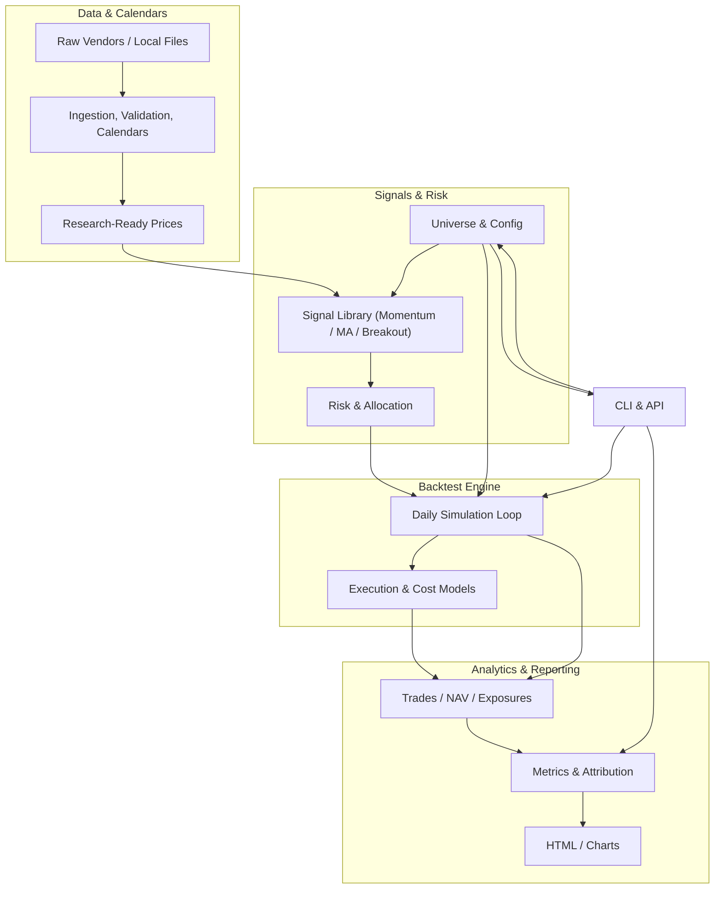

# tf-trend (starter repo)

A professional-grade **systematic trend-following (managed futures)** research and backtesting scaffold in Python, developed and maintained by Engineer Investor ([@egr_investor](https://x.com/egr_investor)).

## Quick Start

```bash
# From repo root
python -m venv .venv && source .venv/bin/activate
pip install -e .

# Smoke test on synthetic data
tf run --config configs/base.yaml

# Produce a basic HTML report
tf report --run-id last

# Run a quick parameter sweep (JSON or YAML grid)
tf sweep --config configs/base.yaml --grid '{"signals.momentum.lookbacks": [[63], [126]]}'

# Walk-forward evaluation with 1-year train / 3-month test windows
tf walkforward --config configs/base.yaml --run-id walk-252x63 --insample 252 --oos 63
```

## Command Line Interface

The `tf` console entrypoint exposes four production-ready commands that cover
single backtests, reporting and both research workflows introduced in phase 8:

| Command | Purpose |
|---------|---------|
| `tf run` | Execute a single backtest and write the full artefact bundle (NAV, positions, trades, charts, summaries). |
| `tf report` | Print the path to the latest HTML/PDF report so it can be opened from automation or notebooks. |
| `tf sweep` | Expand a parameter grid (YAML/JSON) and execute each scenario with optional seed control for robustness studies. |
| `tf walkforward` | Run anchored or rolling walk-forward experiments with configurable train/test splits and per-fold exports. |

All commands accept the same YAML configuration files used by the Python API and
honour override mappings for rapid experimentation.

## Python API & notebooks

The `tf.api` module exposes helpers designed for notebooks and exploratory scripts:

```python
from tf import api

result, context = api.run_backtest("configs/base.yaml")
print(context.universe[0]["symbol"], context.results_dir)

sweep_results, context = api.run_parameter_sweep(
    "configs/base.yaml",
    parameter_grid={"signals.momentum.lookbacks": [[63], [126], [252]]},
    price_seed=123,
)

walkforward_results, _ = api.run_walk_forward(
    "configs/base.yaml",
    insample=252,
    oos=63,
    rolling=True,
)
```

Four worked notebook examples are available in `examples/notebooks/`:

* `quick_start.ipynb` – end-to-end workflow from configuration to analytics.
* `parameter_study.ipynb` – grid search and sweep metadata analysis.
* `attribution.ipynb` – inspect contributions, exposures and roll costs.
* `systematic_trend_following_showcase.ipynb` – comprehensive tour of the full research toolkit.

## Documentation set

Additional user guides live under `docs/`:

* `docs/ADD_INSTRUMENT.md` documents the metadata required when onboarding a new contract.
* `docs/HOW_ROLL_WORKS.md` walks through the roll schedule, continuous series builder and analytics.
* `docs/COST_MODEL_CALIBRATION.md` explains how to calibrate commissions, slippage and ADV assumptions.

The top-level `README` pairs with `SPEC.md` for a condensed architectural overview.

## Architecture overview



## Data quality & QA utilities

Phase 9 adds explicit QA helpers for market data edge cases:

* `tf.data.validators.validate_price_data` enforces monotonic indices, minimum price checks and configurable gap limits.
* `tf.data.validators.detect_trading_suspensions` summarises multi-day trading halts so they can be investigated.
* `tf.data.validators.detect_limit_moves` returns a boolean mask for potential limit-up/down events using percentage thresholds.

Refer to the `tests/test_data_layer.py` suite for concrete usage patterns and expectations around suspensions, holiday gaps and limit moves.

## Layout

```
src/tf/
  data/
  signals/
  risk/
  portfolio/
  engine/
  costs/
  eval/
  report/
  cli.py
configs/
tests/
examples/
```

This is a scaffold with runnable defaults (synthetic data generation) and room to extend.
See `SPEC.md` for the system requirements summary.

## Market data options

The starter configuration now understands contract metadata and can pull daily
settlements from Yahoo! Finance when you prefer real market history.  Populate
``configs/universe.yaml`` with the contracts you care about and run:

```bash
tf run --config configs/base.yaml  # attempts Yahoo first, falls back to synthetic
```

If the Yahoo download fails (e.g. you are offline) the loader automatically
reverts to the reproducible synthetic data generator so unit tests and quick
examples continue to work without an internet connection.

## Testing & quality gates

The automated test suite exercises the full stack, including CLI entry points,
parameter sweeps, walk-forward splits and the new data quality audits.  Run it
locally with:

```bash
pytest -q
```

CI and local developers alike should expect the suite to finish in under a
minute on modern hardware.

## Packaging & releases

The project is packaged as `tf-trend` with dependencies pinned in `pyproject.toml`.
Install via `pip install tf-trend` once a distribution has been built, or use
`pip install -e .` for editable development installs.

Versioned releases are tracked in `CHANGELOG.md`.  Update both the changelog and
the package version before cutting a new release tag to keep artefacts in sync.
